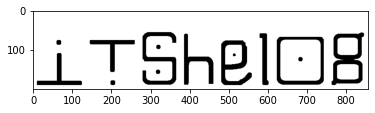

# Ambigrams solver

Words that have rotational symetry are called "ambigrams"


I find most of these online are using tricky font magic where multiple letters are vauge and merged together. But in english there are lots of letters that allready have rotational symetry, such as `b and q` and `d and p`.

Lets see if this is actually a bad idea? See below how I search and find some phrases that work.


```python
# Imports
import os
import cv2
import numpy as np
import matplotlib.pyplot as plt
```


```python
# Letters in english that I was able to form through rotational symmetry
# A B D E F H I L M N O X Z S G J P Q T U W Y

# Letters i failed to do so, you evil characters
# C V K R
```


```python
# Mapping of those letters
matches = [
    ('x','x'),
    ('o','o'),
    ('z','z'),
    ('l','l'),
    ('m','w'),
    ('n','u'),
    ('d','p'),
    ('b','q'),
    ('e','a'),
    ('h','y'),
    ('i','t'),
    ('f','j'),
    ('h','h'),
    ('s','s'),
    ('g','g'),
]
```


```python
# Load images
font_raw = dict()
files = os.listdir('../font')

for f in files:
    loaded_img = cv2.imread('../font/' + f)
    name = f.split('.')[0].lower()
    font_raw[name] = loaded_img
```


```python
# Make fonts cleanly sized
def crop ( img ):
    
    def cut ( img ):
        size = img.shape[0] // 2
        for i in range(2,9):
            cut = img[:size, :]
            if np.min(cut) < 240:
                size -= ( img.shape[0] // (2**i))
            else:
                size += ( img.shape[0] // (2**i))
        return img[size:,:]

    img = cut(img)

    img = cv2.flip(img, 0)
    img = cut(img)
    
    img = cv2.transpose(img)
    img = cut(img)
    
    img = cv2.flip(img, 0)
    img = cut(img)

    img = cv2.transpose(img)
    img = cv2.flip(img, 0)
    img = cv2.flip(img, 1)
    
    # Pad a bit
    img = cv2.copyMakeBorder(img, 10, 10, 10, 10, cv2.BORDER_CONSTANT, value=[255,255,255])

    return img
```


```python
plt.imshow(crop(font_raw['b']))
```


    <matplotlib.image.AxesImage at 0x42df62c10>


    

    


```python
# Crop all the letter and assign pairs
font_full = dict()

# Do crop
for k,v in font_raw.items():
    font_full[k] = crop(v)

# Do matching
for (a,b) in matches:
    if a not in font_full:
        print('Missing letter: ' + a)
    else:
        _ = cv2.rotate(font_full[a], cv2.ROTATE_90_CLOCKWISE)
        _ = cv2.rotate(_, cv2.ROTATE_90_CLOCKWISE)
        font_full[b] = _
```


```python
def merge (images):
    size = 0
    cursor = 0
    for image in images:
        size += image.shape[1]
    img = np.zeros((200, size, 3), np.uint8)
    img[:,:] = 255
    for i,image in enumerate(images):
        img[:image.shape[0], cursor:(cursor+image.shape[1])] = image
        cursor += image.shape[1]
    return img
```


```python
# Loading all our letters into a single image
print("Not the prettiest, never claimed I was an artist")
letters = sorted(list(font_full.keys()))
my_alphabet = merge([ font_full[v] for v in letters])

plt.figure(figsize = (20,2))
plt.imshow(my_alphabet)
```

    Not the prettiest, never claimed I was an artist


    <matplotlib.image.AxesImage at 0x42e022040>


    

    


## Searching for words to try


```python
# Load words from file
with open('words.txt') as f:
    words = set(f.read().splitlines())
```


```python
match_dict = {}
for match in matches:
    match_dict[match[0]] = match[1]
    match_dict[match[1]] = match[0]
```


```python
def try_flip (word) :
    result = list(word)
    for i, letter in enumerate(word):
        if letter in match_dict:
            result[len(word)-i-1] = match_dict[letter]
        else:
            return False
    return ''.join(result)
```


```python
def valid_phrase (phrase) :
    for word in phrase.split(' '):
        if word not in words:
            return False
    return True
```


```python
# What words are valid if we flip the image?
results = []
for word in words:
    flipped = try_flip(word)
    if flipped and valid_phrase(flipped):
        results.append((word, flipped))

# Sort by length
results.sort(key=lambda x: -len(x[0]))
```


```python
print("These words are valid if you flip the image")
top_single_words = results[0:10]
top_single_words
```


    [('play', 'held'), ('age', 'age'), ('it', 'it'), ('am', 'we'), ('we', 'am')]


```python
def render (word):
    size = 0
    cursor = 0
    for letter in word:
        size += font_full[letter].shape[1]
    img = np.zeros((200, size, 3), np.uint8)
    img[:,:] = 255
    for i, letter in enumerate(word):
        img[:font_full[letter].shape[0], cursor:(cursor+font_full[letter].shape[1])] = font_full[letter]
        cursor += font_full[letter].shape[1]
    return img
```


```python
def render_both ( word ) :
    result = render( word )
    _ = cv2.rotate(result, cv2.ROTATE_90_CLOCKWISE)
    flipped = cv2.rotate(_, cv2.ROTATE_90_CLOCKWISE)
    plt.imshow(result)
    plt.show()
    plt.imshow(flipped)
    plt.show()
```


```python
# LOOK! WE FOUND ONE!
render_both("play")
```


    

    


    

    


## Try multiple word phrases


```python
all_phrases = set()
all_flippable_words = set()

# Get flippable
for word in words:
    flipped = try_flip(word)
    if len(word) < 6 and flipped:
        all_flippable_words.add(word)

print("Found {} flippable words".format(len(all_flippable_words)))

# Add Phrases
for word in all_flippable_words:
    all_phrases.add(word)
    for word2 in all_flippable_words:
        all_phrases.add(word + word2)
        for word3 in all_flippable_words:
            all_phrases.add(word + word2 + word3)

print ("Found {} phrases".format(len(all_phrases)))
```

    Found 399 flippable words
    Found 63567955 phrases


```python
# Search for reflections
results = []
total = len(all_phrases)
for i, phrases in enumerate(all_phrases):
    flipped = try_flip(phrases)
    if (i % 1000) == 0:
        print(f"Checking {i}/{total}: {phrases}", end='\r')
    if flipped and flipped in all_phrases:
        results.append((phrases, flipped))
```

    Checking 63567000/63567955: eatmoneywillyln


```python
## Sort by length
results.sort(key=lambda x: -len(x[0]))
results[:10]
```


    [('playplayplay', 'heldheldheld'),
     ('putmindplay', 'heldputwind'),
     ('putwindplay', 'heldputmind'),
     ('playputwind', 'putmindheld'),
     ('playputmind', 'putwindheld'),
     ('putwithplay', 'heldhitmind'),
     ('playageplay', 'heldageheld'),
     ('hitmindplay', 'heldputwith'),
     ('playhitmind', 'putwithheld'),
     ('ageplayplay', 'heldheldage')]


```python
# And some of these almost make sense haha
render_both('putwindplay')
```


    

    


    

    


```python
import random

for i in range(10):
    (a,_) = random.choice(results)

    print("Ambigram:", a,_)
    render_both(a)
    plt.show()
```

    Ambigram: golaysit itshelog


    

    


    

    


    Ambigram: iseaseit itaseast


    

    


    

    


    Ambigram: golayage agehelog


    

    


    

    


    Ambigram: ithit ithit


    

    


    

    


    Ambigram: ohmeplay heldawho


    

    


    

    


    Ambigram: mesaysay heshesaw


    

    


    

    


    Ambigram: mesatpage agediesaw


    

    


    

    


    Ambigram: playitsay hesitheld


    

    


    

    


    Ambigram: itheadoh hopeahit


    

    


    

    


    Ambigram: agegopay hedogage


    

    


    

    

